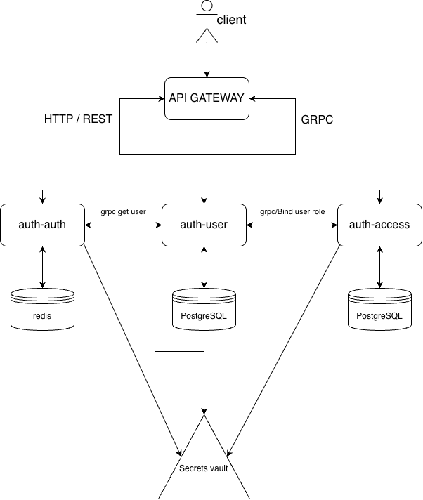
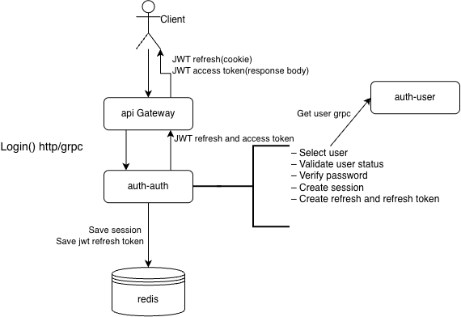
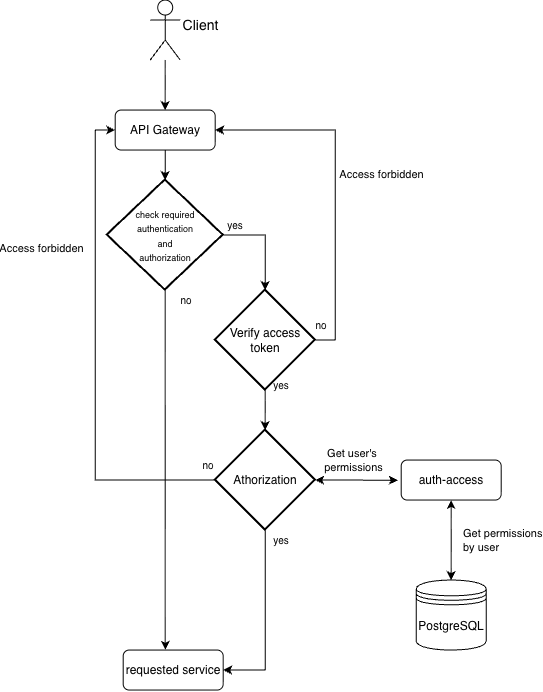
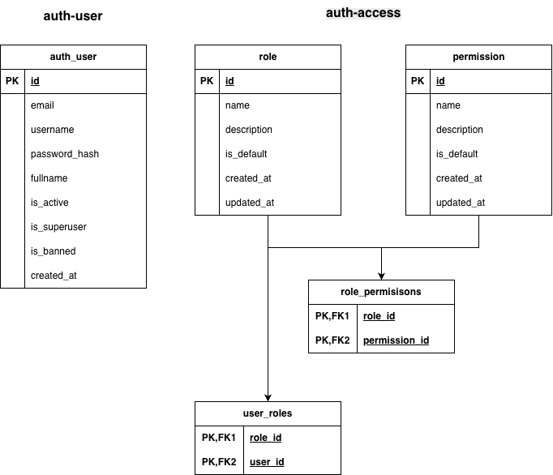

# Auth platform

A production-oriented authorization platform built with Go and a microservice architecture.

The platform provides authentication, authorization (RBAC), API Gateway, JWT token management, gRPC communication between services, and centralized secrets management with HashiCorp Vault.

Go | gRPC | PostgreSQL | Redis | Vault | Docker | Swagger

## About

Auth Platform is a modular authorization platform designed as a collection of independent microservices.

The project demonstrates how a real-world authentication system can be built using modern backend technologies and production-oriented architecture.

Main goals of the project:

- JWT authentication
- Refresh Token Rotation
- Role Based Access Control (RBAC)
- API Gateway
- gRPC communication
- independent databases
- centralized secret management
- Docker deployment

## Architecture

> **Architecture diagram**



## Services

| Service                                                                                                       | Responsibility        |
| ------------------------------------------------------------------------------------------------------------- | --------------------- |
| [auth-api-gateway](https://github.com/GroVlAn/auth-api-gateway/tree/01a7e5dd9c1f98104cdaa109115a08fbfa17759f) | HTTP/gRPC Gateway     |
| [auth-auth](https://github.com/GroVlAn/auth-auth/tree/f70921dfaeaa90d1b58c0c3647e9fe693a9d264d)               | Authentication        |
| [auth-user](https://github.com/GroVlAn/auth-user/tree/9617ab6b582f1fe4c73495be7dc0f9785dc35fce)               | User management       |
| [auth-access](https://github.com/GroVlAn/auth-access/tree/26d8ba8184606c233b62a373b2d76d85f182f0a5)           | Roles and Permissions |
| [auth-api](https://github.com/GroVlAn/auth-api/tree/f0aed1b91f2149de43ba4676e8602a3a17e00fad)                 | gRPC contracts        |
| [auth-base](https://github.com/GroVlAn/auth-base/tree/e621964a91bfa2c9bcedfc3198d5e9164354ae79)               | Shared libraries      |
| [auth-open_api](https://github.com/GroVlAn/auth-open_api/tree/87ccfbb172bfa1354d99942f198318046543196a)       | Swagger/OpenAPI       |

## Features

- JWT Authentication
- Refresh Token Rotation
- Access Token Validation
- RBAC
- Role Management
- Permission Management
- API Gateway
- gRPC
- PostgreSQL
- Redis
- Vault
- Swagger UI
- Docker Compose

## Tech Stack

Backend

- Go
- Chi
- gRPC
- sqlx

Databases

- PostgreSQL
- Redis

Infrastructure

- Docker
- Docker Compose
- Vault

Documentation

- Swagger/OpenAPI

## Project Structure

```text
auth-platform
│
├── docker-compose.yml
├── example.env
├── README.md
│
├── services
│   ├── auth-api-gateway
│   ├── auth-auth
│   ├── auth-user
│   ├── auth-access
│   ├── auth-api
│   ├── auth-base
│   └── auth-open_api
│
├── architecture
│
└── docs
```

## Quick Start

### Clone repository

git clone ...

### Initialize Git submodules

git submodule update --init --recursive

### Copy environment variables

cp example.env .env

### Build project

docker compose up --build

### Open Swagger

http://localhost:8001

## Login sequence

> **Login sequence diagram**



## Authorization sequence

> **Authorization sequence diagram**



## Database schema

> **Database schema diagram**


